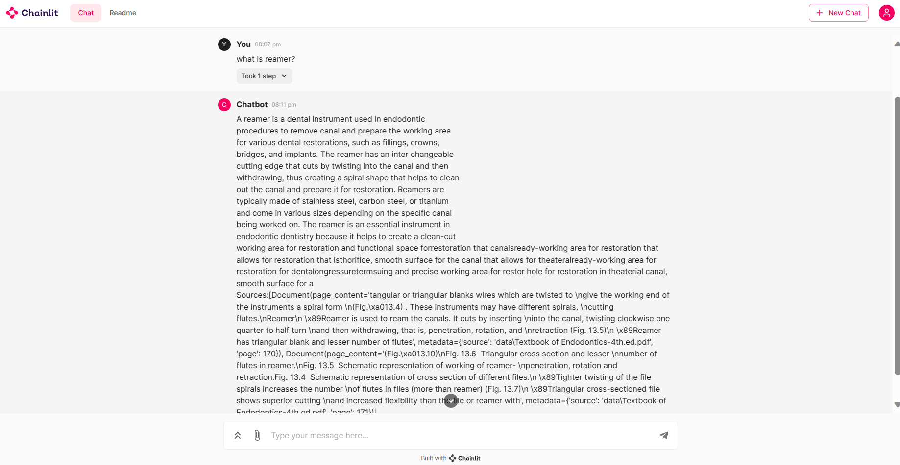

## Medical Chatbot using Llama 2
# Overview
This repository contains the code for a Medical Chatbot developed using the Llama 2 model. The chatbot is designed to run on a CPU machine and utilizes various Python libraries and techniques for efficient query processing and response generation in a medical context.
## Features
- Llama 2 Chatbot: Utilizes the Llama 2 model for generating responses.
- FAISS Vector Store: Implements FAISS for efficient similarity search in large datasets.
- HuggingFace Embeddings: Leverages sentence-transformers for embedding generation.
- Custom Chatbot Workflow: Includes functions for chatbot activation, conversation setup, and response retrieval.
## File Description
- model.py: Contains the main chatbot logic including chatbot activation, conversation setup, and answer retrieval functions.
- main.py: Manages the ingestion of data, vectorization, and creation of the FAISS index.
## Setup and Installation
```
create conda -= venv python==3.9 -y
conda activate venv/
pip install -r requirements.txt
python main.py  # There should not be a folder called vector store, after running this command, it will make a directory there.
chainlit run model.py -w
```

